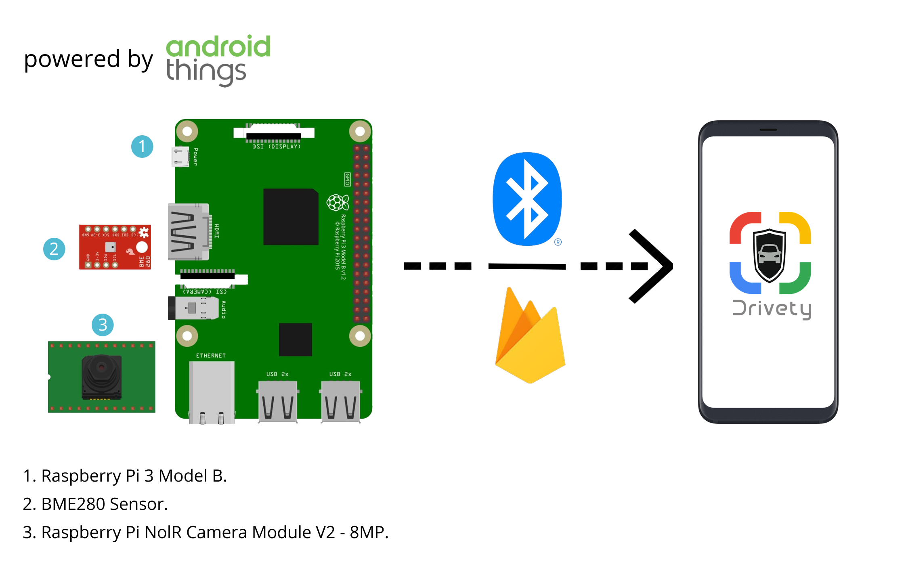
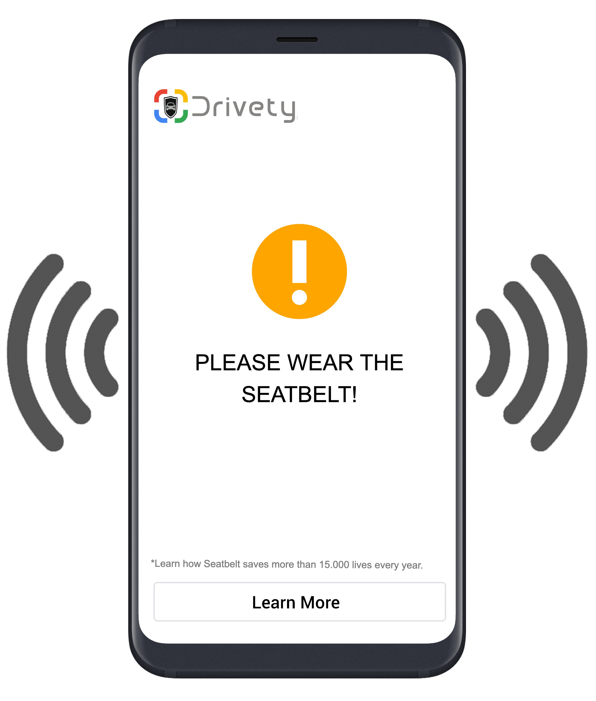
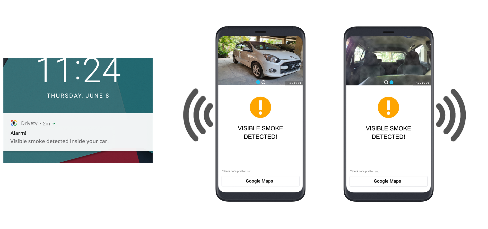
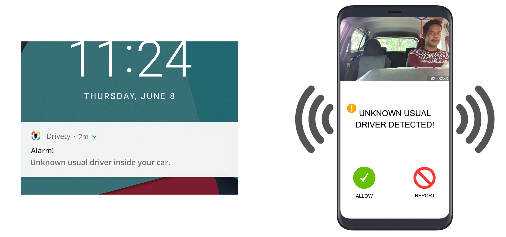

### 
___

 
 
With the **TensorFlow Lite models** integrated, Smart App Drivety unlocks new experience where every car can have the same high-end security features now. Drivety offers:
 
 
## Seatbelt Worn Detection
### Problem: 
Some new cars have already been installed with seatbelt reminder detector, but the older one majorly hasn't. 

Drivety will act as that reminder but with more informative interface to increase awareness of some ignorant passengers while their safety is at risk rather than emitted **“Beep”** boring notification sound like in some common cars.
 
 
**Android Things:**
 
 

 
 

**Mobile App:**

 
 

## Crime Detection
### Problem: 
On-demand transportation services, e.g. Uber, Grab, Gojek, etc grow rapidly. Meanwhile the related crime rate (attempted rape and murder) increases respectively.

Drivety will take role to detect if any of those crime potential to be happened by sending payload (driver face, vehicle registration plate, latest Google Maps coordinate, etc) emergency notification immediately to the authority in charge and nearby Drivety users for early rescue.
 
 
**Android Things:**
 
 

 
 

**Mobile App:**

 
 

## Visible Smoke, Heatstroke & Dangerous Chemical Gas Leak Detection
### Problem: 
Once we’re outside of the car, no one guarantees what an unexpected thing is going to potentially happen inside. Take an example, there are numerous incidents where kids died after their family left them either for a while even hours inside the car. Turns out heatstroke or accumulated leaked **Carbon Monoxide (CO)** gas came through ventilation are the major cause.

With the heat temperature and air quality sensor installed on the IoT device, Drivety immediately sends emergency notification to the car owner, nearby Drivety users or authority in charge for early rescue.

Drivety is also integrated with smart detection to detect if any visible smoke surrounding inside car.
 
 
**Android Things (Visible Smoke):**
 
 

 
 

**Mobile App (Visible Smoke):**

 
 
**Android Things (Heatstroke):**
 
 

 
 

**Mobile App (Heatstroke):**

 
 

## Potential Car Theft Detection
### Problem: 
Sure this is a common problem 😨.

Drivety will detect and immediately send payload notification to the car owner confirming the car is being driven by an unrecognized usual driver. If owner confirms ​**“REPORT”​**, Drivety immediately forwards the payload emergency notification to the authority in charge for early action.
 
 
**Android Things:**
 
 

 
 

**Mobile App:**

 
 

There are a lot of other features we can integrate inside Drivety actually, say:
- **Oil & Fuel Management Prediction Based Distance Record by Google Maps.**
- **Drunk / Fatigue Driver Detection.**

But to keep it simpler, Drivety is satisfied with those 4 major features for now.
___
With the above feature showcases, we understand the Drivety’s IoT companion device has to be always in **online** state for sending the payload notification. Hence, user / driver / passenger needs to provide network data service inside car, say:
- Turning Smartphone into Hotspot itself,
- Some portable Wi-Fi devices, e.g., Vinli Wi-Fi Smart Car Connector and OBD-II,
- etc...

